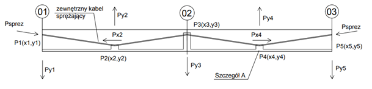
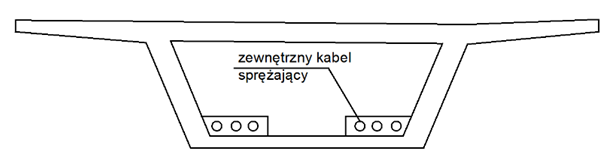
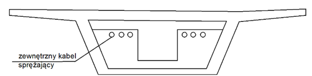
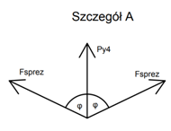
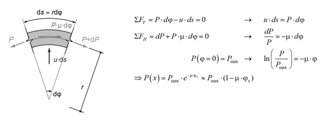
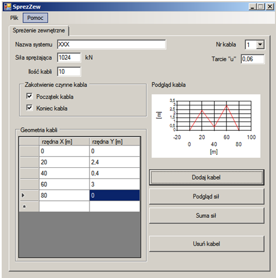
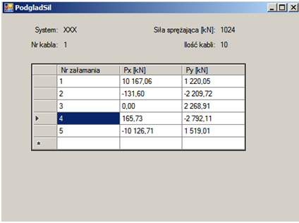
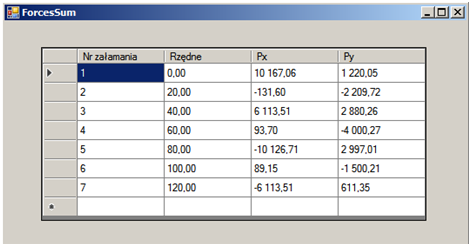
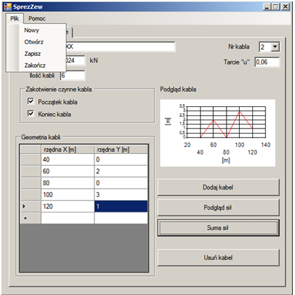

# Wprowadzenie
SprezZew to program, który oblicza siły powstałe przy sprężeniu mostu kablami zewnętrznymi. Wynikiem programu są siły, które są wprowadzane do programu obliczeniowego (np. Robot) podczas definicji przypadku obciążeń k
## Zastosowanie 
Dzięki specjalnej trajektorii zewnętrzne kable sprężające wywołują naprężenia odciążające most. Na rysunku poniżej przedstawiony jest układ sił powstały przy wprowadzeniu siły do jednego kabla. 

_Przekrój podłużny mostu – rozkład sił oraz punktów zagięcia._

 
_Przekrój przy dewiatorze (głównie środek przęsła)_

 
_Przekrój przy podporze_

 

## Rozkład sił
Przy zastosowaniu superpozycji sił można obliczyć wypadkowe działające na ustrój nośny od kabli zgodnie ze szczegółem „A”
  

## Tarcie
Przy wygięciu kabla towarzyszy nam siła tarcia zależna od kąta wygięcia kabla oraz od siły sprężającej. Poniżej przedstawiony jest rysunek ze wzorami, które opisują tę zależność.
  

## Zakotwienie
Głównie zewnętrzne kable są sprężane z obu stron co oznacza, że na początku jak i na końcu jest zakotwienie czynne.  Siła w kablu maleje zatem wraz z odległością od zakotwienia czynnego. Siła ta jest tracona przez tarcie przedstawione powyżej.

# Opis programu (obsługa)

**Ekran główny**
  
**_Nazwa systemu:_** Tutaj wprowadzamy nazwę systemu, który został ustalony przez projektanta. 
**_Siła sprężajaca:_** Jest to siła już po stratach po zakotwieniu. 
**_Ilość kabli:_** Wprowadzamy tutaj ilość kabli, która odpowiada danej geometrii. 
**_Zakotwienie czynne kabla:_**  Tutaj zaznaczamy z której strony jest kabel jest sprężony. 
**_Geometria kabli:_**  Wprowadzamy tutaj rzędne kabla, aby ustalić jego geometrie. 
**_Tarcie „u”:_** Jest to wartość tarcia dla poszczególnego systemu. Tą wartosć można odnaleźć w dopuszczeniu dla danego systemu. 
**_Podgląd kabla:_** Przedstawia pomocniczy obrazek, który pozwala nam sprawdzić czy geometria kabla zgadza się z naszymi przypuszczeniami. 
**_Dodaj kabel:_** Po wypełniniu wszystkich danych dotyczących poszczególnego kabla możemy dodać kabel do obliczeń. 
**_Usuń kabel:_**  Usuwa kabel. 

**_Podgląd sił_**: Przedstawia siły na ustrój powstałe po dodaniu kabla. UWAGA: Najpierw należy dodać kabel, żeby móc zobaczyć siły w kablu.
  

**_Suma sił_**:  Pokazuję siły od wszystkich kabli, które należy wprowadzić do modelu
  

Otwieranie/Zapisywanie pliku
Klikając w górnym pasku na „Plik” mamy opcje utworzenia nowego projektu, otworzenia istniejącego projektu oraz zapisu. 
  

Plik zapisu jest tworzony w postaci txt. Można z tego pliku bezposrednio skopiować dane oraz wyniki projektu. 
